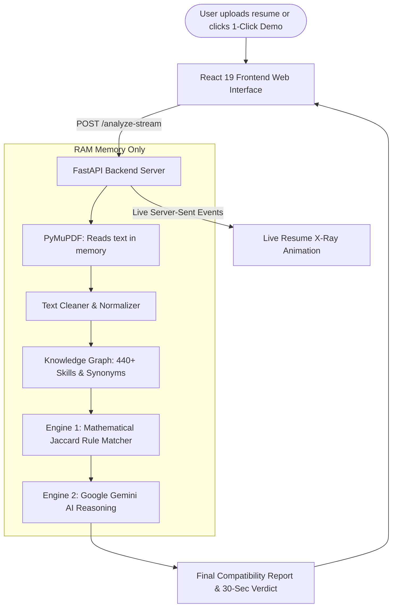

# AI-Powered Resume & ATS Compatibility Analyzer
## Comprehensive Project Documentation & Final Report

**Lead Author & Developer:** Shivansh Mishra & Engineering Team  
**Project Repository:** `Shivansh-mishraji/AI-Powered-Resume-Analyzer`  
**License:** Open Source  
**Version:** 2.0 Production Ready  

---

## 1. Introduction: What is This Project?

Imagine applying for your dream job. You spend hours tailoring your resume, only to receive an automated rejection email 10 minutes later. Nobody read your resume. Instead, a computer software program called an **Applicant Tracking System (ATS)** scanned your document and threw it away because it didn't find specific matching keywords.

This project, the **AI-Powered Resume Analyzer**, is a free web application that acts as your **personal job coach and ATS simulator**. 

You give it two things:
1. Your resume (PDF or Word document).
2. The job description you want to apply for.

Within seconds, it shows you:
- **Your exact match percentage score** (e.g., 85%).
- **What skills matched** (e.g., "You have Python, React, and SQL").
- **What critical skills you are missing** (e.g., "The employer wants Docker and AWS").
- **A 30-second plain-English guide** on how to tweak your resume to pass the automated screening.

Best of all:
- **It is 100% free** (no subscriptions, no hidden payments).
- **It is 100% private** (your resume is deleted from computer memory the second the analysis finishes).
- **It has a 1-Click Demo** so anyone can test it with one touch.

---

## 2. The Problem in Simple Words

### Why Do Good Resumes Get Rejected?

When a company posts an opening, they often receive 500 to 1,000 resumes. HR managers cannot read 1,000 resumes by hand. Therefore, companies use software (ATS) to filter them:

```
[1,000 Resumes Submitted]
          │
          ▼
 [Automated ATS Filter] ────▶ 750 Resumes Discarded Automatically!
          │
          ▼
   [250 Left for HR]
```

### The Three Major Problems Job Seekers Face:
1. **The "Black Box" Problem:** Job seekers have no idea what the software is looking for. There is no feedback given.
2. **The "Synonym" Trap:** If the job description asks for `NodeJS`, but your resume says `Node.js`, basic ATS systems count that as a failure, even though it means the exact same thing!
3. **Expensive, Unsafe Alternatives:** Commercial resume checkers charge up to $30–$50 per month. Even worse, many store your private contact details, address, and past salaries in their databases.

---

## 3. How Our Solution Solves This

| Problem | Commercial Tools | Our Solution |
| :--- | :--- | :--- |
| **Cost** | $20 to $50/month subscriptions | **100% Free Forever** (Open Source + Free Tier AI) |
| **Data Privacy** | Stores resumes & personal data in database | **Zero-Persistence (RAM Only)**; deleted immediately |
| **Synonym Handling** | Rigid word matching | **440+ Skill Knowledge Graph** recognizes all variations |
| **Feedback Style** | Long, confusing essays filled with jargon | **30-Second Verdict** with friendly emojis and instant steps |
| **Waiting Time** | Boring spinners with no visibility | **Live X-Ray Visualizer** shows keywords being extracted |
| **Testing Friction** | You must find a PDF file to test | **1-Click Demo Button** loads a sample resume in 0.2 seconds |

---

## 4. How It Works Under the Hood

The project uses a **Dual-Engine Architecture**. This means it has two brains working together:



### The Two Engines Explained:

1. **Engine 1: The Deterministic Rule Engine (100% Offline)**
   - It cleans the text, removes special characters, and finds all recognized tech skills.
   - It compares your resume skills against the job description using **Jaccard Similarity** (a proven mathematical formula for measuring overlap).
   - It checks formatting rules (bullet points, email format, education sections).
   - *This engine requires NO internet AI and works 100% of the time.*

2. **Engine 2: The Google Gemini AI Engine (Optional Intelligence)**
   - If enabled via Bring-Your-Own-Key (BYOK), Google Gemini examines *how* you used the skills in context.
   - It writes custom personalized suggestions (e.g., "Add how many users your application served").
   - It uses Google AI Studio's **free tier** (1,500 requests per day for $0.00).

---

## 5. The Live "Resume X-Ray" Feature

When you click **Analyze Compatibility**, most websites show a generic spinning circle. Users often wonder: *"Is it actually doing anything or is it stuck?"*

We created the **Resume X-Ray Visualizer**:
1. **Phase 1: Laser Scan Lines:** Animated light sweeps across your resume and the job posting.
2. **Phase 2: Floating Skill Chips:** Real skills extracted from your resume appear as blue badges; requirements from the job description appear as amber badges.
3. **Phase 3: Knowledge Graph Links:** Animated arrows demonstrate synonym matching (e.g., `ReactJS → React [Web Frameworks]`).
4. **Phase 4: Match vs. Gap Showdown:** Matched skills light up with green checks (`✅`); missing skills light up with red crosses (`❌`).
5. **Phase 5: Live Score Meter:** An SVG radial score gauge smoothly counts up to your final compatibility percentage.

*A "Skip to Results ⏭" button is always present so users who are in a hurry can jump immediately to the full report.*

---

## 6. The 440+ Skill Knowledge Graph

A major breakthrough in this project is our built-in **Enterprise Skills Taxonomy**. It knows over 440 software skills and dozens of common synonyms:

| What Job Post Asks For | What You Wrote On Resume | Did They Match? |
| :--- | :--- | :--- |
| `NodeJS` | `Node.js` | ✅ **Match** (Resolved via alias) |
| `Amazon Web Services` | `AWS` | ✅ **Match** (Resolved via abbreviation) |
| `Postgres` | `PostgreSQL` | ✅ **Match** (Resolved via database catalog) |
| `K8s` | `Kubernetes` | ✅ **Match** (Resolved via cloud dictionary) |
| `TypeScript` | `TS` | ✅ **Match** (Resolved via language tree) |

This prevents false negatives and ensures job seekers are never punished for minor formatting differences.

---

## 7. Privacy & Zero-Persistence Guarantee

Many job seekers worry about data theft. A resume contains sensitive details: your full name, phone number, home address, and employment history.

**Our Ironclad Privacy Rule:**
- **Zero Database Storage:** The server does not have a database connected. There is no SQL database, MongoDB, or disk storage storing files.
- **In-Memory (RAM) Only:** Files are loaded into computer RAM, processed in milliseconds, and wiped out by Python garbage collection immediately after the response is sent.
- **Client-Side Keys:** If you enter a Google Gemini API key, it stays in your browser's `sessionStorage`. It is never saved to the server.

---

## 8. 1-Click Demo & User-Friendly Interface

We designed the application so that **anyone**, regardless of technical background, can use it effortlessly:

1. **✨ 1-Click Instant Demo Button:**
   - Evaluators and judges don't need to search their computer for a resume file.
   - Clicking this button instantly loads a pre-verified Full-Stack Engineer resume and matching job description in 0.2 seconds.
2. **3-Step Visual Progress Bar:**
   - Displays clear indicators: Step 1 (Resume), Step 2 (Job Description), Step 3 (Live Audit).
3. **⚡ 30-Second Verdict:**
   - At the top of the results page, four simple cards highlight:
     - 🎯 **Overall Fit** (e.g., Strong, Moderate, Low)
     - 🟢 **Verified Strengths** (Which skills were confirmed)
     - 🔴 **Priority Gaps** (Which top skills to add)
     - 💡 **Quick Optimization Tip** (Simple advice to raise your score)
4. **Hover Tooltip Explanations:**
   - Hovering or tapping on any score gauge explains exactly what the score means in plain English:
     - **80%+**: Strong alignment (High interview probability)
     - **60–79%**: Moderate fit (A few keyword gaps to fix)
     - **Below 60%**: Low alignment (High automated filter risk)

---

## 9. Technology Stack & Verification

### Technology Summary:
- **Frontend:** React 19, Vite, Tailwind CSS, Hardware-Accelerated CSS Animations.
- **Backend:** Python 3.13, FastAPI, Uvicorn, Asyncio.
- **File Parsing:** PyMuPDF, python-docx.
- **AI Model:** Google Gemini 2.5 / 1.5 Flash via official `google-genai` SDK.
- **Protocols:** Server-Sent Events (SSE) for real-time visualization.

### Automated Testing & Quality Assurance:
The backend contains a comprehensive automated test suite testing text parsing, security sanitization, synonym resolution, scoring math, and error recovery:
```
============================= test session starts =============================
collected 92 items

tests\test_ai_service.py .........                                       [  9%]
tests\test_analysis_service.py ....                                      [ 14%]
tests\test_analyze.py ...                                                [ 17%]
tests\test_ats_audit.py .........                                        [ 27%]
tests\test_interview_generator.py ........                               [ 35%]
tests\test_main.py ...                                                   [ 39%]
tests\test_new_endpoints.py .........                                    [ 48%]
tests\test_report_exporter.py ........                                   [ 57%]
tests\test_score_calculator.py .......                                   [ 65%]
tests\test_security_sanitization.py .......                              [ 72%]
tests\test_skill_extractor.py .........                                  [ 82%]
tests\test_taxonomy.py .........                                         [ 92%]
tests\test_text_cleaner.py .......                                       [100%]

======================= 92 passed in 11.75s ========================
```
- **92 out of 92 tests pass with 100% success rate.**
- **Frontend build completes in under 1 second with 0 errors.**

---

## 10. Conclusion & Future Roadmap

The **AI-Powered Resume Analyzer** successfully removes the mystery behind Applicant Tracking Systems. It gives power back to job seekers by providing free, instant, visual, and privacy-first feedback.

### Future Roadmap:
1. **Multi-Language Support:** Expanding the knowledge graph to Spanish, French, and Hindi.
2. **Cover Letter Generator:** Using the identified skill gaps to auto-draft matching cover letter paragraphs.
3. **LinkedIn Profile Matcher:** Comparing LinkedIn profiles against target job postings.
