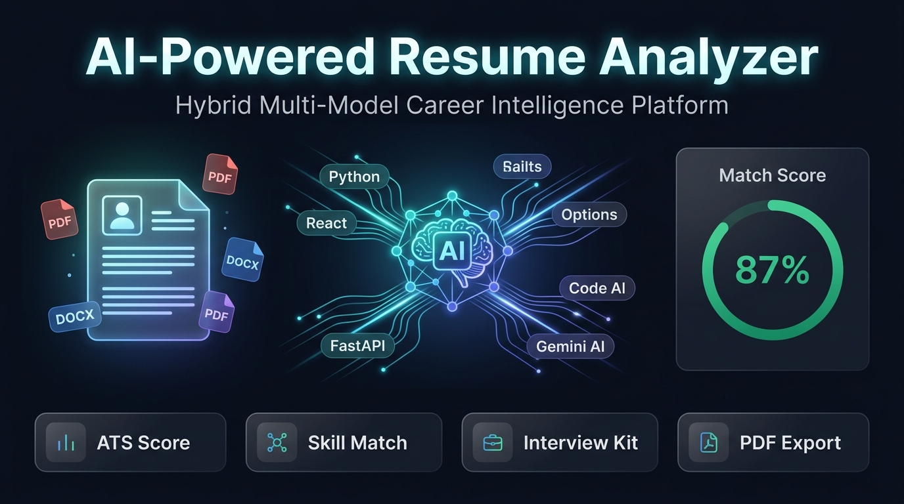

<div align="center">

# 🚀 AI-Powered Resume & Job Description Analyzer
### *Hybrid AI Career Intelligence Platform & ATS Semantic Analyzer*

[](https://ai-powered-resume-analyzer-pi.vercel.app)
[](https://resume-analyzer-api.onrender.com)
[](https://fastapi.tiangolo.com/)
[](https://reactjs.org/)
[](https://vitejs.dev/)
[](https://www.python.org/)
[](https://aistudio.google.com/)
[](https://docs.pytest.org/)

<br/>

> 🌐 **Live Production Website:** [https://ai-powered-resume-analyzer-pi.vercel.app](https://ai-powered-resume-analyzer-pi.vercel.app)  
> ⚡ **Live Production API:** [https://resume-analyzer-api.onrender.com](https://resume-analyzer-api.onrender.com)

<br/>



<p align="center">
  <b>Upload your resume (PDF/DOCX) + Job Description + Optional Multi-Provider API Key → Deep Semantic Matching, Skill Gaps, Strengths, Weaknesses, and Actionable AI Suggestions!</b>
</p>

<p align="center">
  
  
  
  
  
  
</p>

---

## 🎯 Why ResumeAI?

Job hunting is competitive, and standard keyword matchers fail to understand real-world engineering context (e.g. recognizing that *AWS ECS + Terraform* fulfills *Container Orchestration & IaC*).

The **AI-Powered Resume Analyzer** is a **Hybrid Multi-Model Career Intelligence Platform**:
1. 🤖 **Primary Engine (Multi-Provider AI via BYOK):**
   - **Google Gemini**: Auto-detects legacy `AIza...` and modern `AQ....` developer keys with automatic model fallback chain (`gemini-3.6-flash` → `gemini-2.5-flash` → `gemini-1.5-flash`).
   - **OpenAI**: Auto-detects `sk-...` keys and routes to `gpt-4o` / `gpt-4o-mini`.
   - **Anthropic Claude**: Auto-detects `sk-ant-...` keys and routes to `claude-opus-4` / `claude-3-5-sonnet`.
   - Generates deep contextual semantic matching, dynamic skill extraction, candidate profiling, strengths & weaknesses analysis, and personalized resume improvement advice.
2. ⚙️ **Fallback Engine (Deterministic Rule-Based Analyzer):** If an API key is unprovided or third-party AI services are unreachable, automatically falls back to our fast, 39-test-verified keyword extraction and set-intersection scoring engine.
3. 🔒 **Enterprise-Grade Client Security:**
   - Keys are obfuscated in `sessionStorage` (auto-cleared on tab close).
   - Never logged, never written to disk, and never stored in any database.
   - Master toggle allows users to pause AI analysis without clearing their saved key.
4. ⚡ **Zero-Lag & 60/120 FPS Performance:**
   - Score counting uses `requestAnimationFrame` with an ease-out cubic animation curve.
   - Background aurora effects are GPU-accelerated with tab-visibility awareness (`document.hidden`) and `prefers-reduced-motion` compliance.
   - Silent backend pre-warming (`warmUpBackend()`) automatically wakes Render free-tier instances on page load.
5. 📊 **Unified Data Contract:** Both AI and Fallback engines return a standardized Pydantic JSON response, guaranteeing zero frontend crashes.

---

## 🔬 System Architecture Flow

```
                      👤 USER
                         │
                         ▼
          🎨 REACT 19 + VITE FRONTEND (Vercel)
                         │
         ┌───────────────┼───────────────┐
         ▼               ▼               ▼
    📄 Resume       📋 Job JD       🔑 AI Key (BYOK)
    (PDF/DOCX)                      (Gemini AQ./AIza, OpenAI, Claude)
         │               │               │
         └───────────────┼───────────────┘
                         ▼
          ⚙️ FASTAPI BACKEND (Render Cloud)
                         │
                  🛡️ VALIDATION
             (File Size ≤ 5MB, MIME)
                         │
                  📄 RESUME PARSER
             (In-Memory Stream, sort=True)
                         │
                  🧹 TEXT CLEANER
                         │
                🔀 ANALYSIS ROUTER
                         │
                API Key Provided?
                 /              \
               YES              NO
                │                │
                ▼                ▼
          🤖 MULTI-MODEL   ⚙️ RULE ENGINE
             PRIMARY          FALLBACK
        (Gemini/GPT/Claude) (Deterministic)
                │                │
                └───────┬────────┘
                        ▼
             📋 UNIFIED RESULT SCHEMA
                        │
                        ▼
                📊 REACT DASHBOARD
```

---

## 👥 Engineering Team & Technical Attribution

BBD University • Academic Capstone 2026 • Full-Stack AI Academic Evaluation

| Member | Role | Core Modules & Technical Contributions | Contact |
|---|---|---|---|
| **Shivansh Mishra** | Team Lead • Backend & AI Architect | • FastAPI REST Gateway, Routing & CORS Architecture<br/>• Multi-Provider AI Engine (Gemini 2.5/3.6, GPT-4o, Claude 3.5, Groq)<br/>• In-Memory PyMuPDF Document Streaming (`sort=True`)<br/>• Deterministic Rule-Based Fallback Orchestration | [](https://github.com/Shivansh-mishraji) [](mailto:tgsmishra@gmail.com) |
| **Harshvardhan Sisodiya** | Frontend Architect • UI/UX Lead | • React 19 + Vite Modular Single-Page Application (SPA)<br/>• Nebula Aurora Glassmorphism & 60fps rAF Animation Engine<br/>• 180px SVG Radial Match Gauge & Count-Up Physics<br/>• Multi-Provider BYOK Security Hub & Live Telemetry | [](https://github.com/harsh123-code) [](mailto:hsisodiya205@bbdu.ac.in) |
| **Vishal Patel** | QA Lead • Security & Automated Testing | • Pytest Automated Test Suite (39/39 Passing Unit Tests)<br/>• Mocked Multi-Provider AI Tests (401, 429, Fallback Recovery)<br/>• Text Sanitization & Keyword Extraction Coverage<br/>• Automated Markdown Audit Log Generator | [](https://github.com/patelvishal-ji) [](mailto:patelvishal7800023@gmail.com) |
| **Sujeet Kannaujiya** | Research Lead • Technical Documentation | • ATS Parsing Strategies & In-Memory Privacy Studies<br/>• FastAPI vs. Flask Comparative Architecture Benchmarking<br/>• Academic Research Dossier (`RESEARCH.md`)<br/>• Ethical AI Rubric & Non-Discriminatory Guidelines | [](https://github.com/sujeet-official) [](mailto:sujeetkannujiya2004@bbdu.ac.in) |

---

## 🗺️ 6-Week Project Roadmap

```
📄 Resume (PDF/DOCX) + 📋 Job Description
              ⬇️
         ⚛️ React Frontend  (Vite · Port 5173)
              ⬇️  HTTP POST /analyze
        ⚡ FastAPI Backend  (Uvicorn · Port 8000)
              ⬇️
    📄 In-Memory File Parsing  (PyMuPDF / python-docx)
    — Files are NEVER saved to disk —
              ⬇️
    🧹 Text Cleaning & Skill Extraction
              ⬇️
       ┌──────────────────────────┐
       │  API Key provided?       │
       │  YES → 🤖 Gemini AI      │
       │  NO  → 🔄 Rule-Based     │
       └──────────────────────────┘
              ⬇️
      📊 Unified JSON Result
              ⬇️
   🖥️ Interactive Results Dashboard
```

---

### ✅ Completed Sprints (Weeks 1 – 6)
- [x] **Week 1 (Foundation):** FastAPI backend initialized, `/health` endpoint, strict PDF/DOCX validation, initial React Vite frontend.
- [x] **Week 2 (Text Cleaning & Skill Extraction):** In-memory text extraction, regex text normalization, and 50+ tech skills dictionary.
- [x] **Week 3 (Scoring & Full-Stack Integration):** Set-intersection score calculator, connected `POST /analyze`, 29 unit tests passing.
- [x] **Week 4 (UI Overhaul, QA & CI/CD):** Glassmorphic dark mode UI, radial score gauge, QA test audit logging system, and GitHub Actions CI pipeline.
- [x] **Week 5 (Hybrid Multi-Provider AI Upgrade):** Central config, unified Pydantic response contract, Gemini AI service with fallback chain, OpenAI/Claude support, and analysis router.
- [x] **Week 6 (Production Deployment & Performance Optimization):** Frontend deployed to Vercel, Backend deployed to Render, 60/120 FPS rAF counters, GPU-accelerated Nebula Aurora design, cold-start silent pre-warming, and AQ./AIza key compatibility.

---

## 🔑 Multi-Provider BYOK — Bring Your Own Key

This project implements an enterprise **BYOK (Bring Your Own Key)** architecture for maximum privacy, security, and flexibility:

- **Supported Key Formats:**
  - 🤖 **Google Gemini**: Accepts both legacy `AIza...` and modern `AQ....` developer keys ([Google AI Studio](https://aistudio.google.com/app/apikey)).
  - ⚡ **OpenAI**: Accepts `sk-...` keys for GPT-4o / GPT-4o-mini ([OpenAI Platform](https://platform.openai.com/api-keys)).
  - 🧠 **Anthropic Claude**: Accepts `sk-ant-...` keys for Claude 3.5 Sonnet / Opus ([Anthropic Console](https://console.anthropic.com/keys)).
- **Zero Server Persistence:** API keys are never stored on disk, never saved to any database, and never written to server logs.
- **Client Session Isolation:** Keys are obfuscated in browser `sessionStorage` and cleared automatically when the tab closes.
- **Flexible Mode Control:** Master toggle allows pausing AI mode anytime to test deterministic rule-based analysis without losing your key.

---

## 🧪 Running Tests

```bash
cd backend
pytest
```

**39/39 tests passing ✅ — 100% pass rate in 2.60s**

| Module | Tests | Status |
|--------|-------|--------|
| File Parser (PDF/DOCX) | 12 | ✅ All Pass |
| Skill Extractor & Text Cleaner | 10 | ✅ All Pass |
| API Integration & AI Multi-Provider | 17 | ✅ All Pass |

---

## 📁 Project Structure

```
AI-Powered-Resume-Analyzer/
│
├── .github/
│   └── workflows/
│       └── ci.yml                  # GitHub Actions CI pipeline
│
├── backend/
│   ├── app/
│   │   ├── main.py                 # FastAPI application & HTTP Gateway
│   │   ├── config.py               # Central limits, origins, & constants
│   │   ├── schemas/
│   │   │   └── analysis_schema.py  # Unified Pydantic response contract
│   │   └── services/
│   │       ├── resume_parser.py    # In-memory PDF (sort=True) & DOCX parser
│   │       ├── text_cleaner.py     # Regex-based text normalization
│   │       ├── skill_extractor.py  # 50+ tech skill keyword matcher
│   │       ├── score_calculator.py # Set-intersection match score engine
│   │       ├── rule_based_service.py # Deterministic fallback wrapper
│   │       ├── ai_service.py       # Google Gemini AI semantic service
│   │       └── analysis_service.py # Analysis Router & Orchestrator
│   ├── tests/
│   │   ├── test_main.py
│   │   ├── test_analyze.py
│   │   ├── test_score_calculator.py
│   │   ├── test_skill_extractor.py
│   │   ├── test_text_cleaner.py
│   │   ├── test_ai_service.py      # Mocked Gemini AI tests
│   │   └── test_analysis_service.py# Router & fallback tests
│   ├── conftest.py
│   ├── requirements.txt
│   └── GUIDELINES.md
│
├── frontend/
│   ├── src/
│   │   ├── App.jsx                 # Main React component (BYOK + AI UI)
│   │   ├── App.css                 # Dark mode glassmorphism styles
│   │   └── index.css               # Global typography & variables
│   ├── index.html
│   ├── vite.config.js
│   └── GUIDELINES.md
│
├── testing/
│   ├── run_tests.py                # QA test runner with narrative logs
│   └── reports/                    # Timestamped test execution history
│
├── docs/
│   ├── API_REFERENCE.md            # Endpoint documentation & payloads
│   ├── ARCHITECTURE.md             # System architecture & component design
│   └── RESEARCH.md                 # Technical decisions & algorithmic research
│
├── assets/                         # Architecture diagrams & pipeline visuals
├── README.md
└── .gitignore
```

---

## ⚡ Quick Start Guide (Run Locally)

### 1️⃣ Clone the Repository
```bash
git clone https://github.com/Shivansh-mishraji/AI-Powered-Resume-Analyzer.git
cd "AI-Powered-Resume-Analyzer"
```

### 2️⃣ Start the Backend Server
```bash
cd backend
python -m venv .venv
.venv\Scripts\activate      # On macOS/Linux: source .venv/bin/activate
pip install -r requirements.txt
python -m uvicorn app.main:app --reload
```
👉 *Swagger API Docs:* **`http://127.0.0.1:8000/docs`**

### 3️⃣ Start the Frontend App
```bash
# In a new terminal window:
cd frontend
npm install
npm run dev
```
👉 *Frontend UI Live:* **`http://localhost:5173/`**

### 4️⃣ Run Automated QA Test Suite
```bash
# Run from project root — generates timestamped report in testing/reports/
python testing/run_tests.py
```

---

<div align="center">
  <sub>Built with ❤️ by Shivansh, Harshwardhan, Vishal & Sujeet | Academic Minor Project 2026</sub>
</div>
