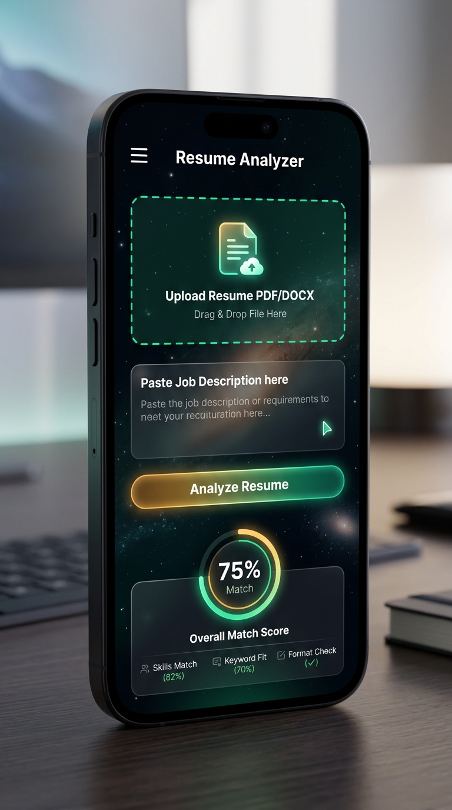

<p align="center">
  
</p>

<p align="center">
  <strong>Upload your resume. Paste a job description. Get an AI-powered match score, skill gap analysis, and personalized improvement suggestions — instantly.</strong>
</p>

<p align="center">
  
  
  
  
  
</p>

---

## 👥 Team

| Member | Role | GitHub |
|---|---|---|
| **Shivansh Mishra** | Team Lead · Backend Architecture & AI Integration | [@Shivansh-mishraji](https://github.com/Shivansh-mishraji) |
| **Harshvardhan Sisodiya** | Frontend Development & UI/UX Design | [@harsh123-code](https://github.com/harsh123-code) |
| **Vishal Patel** | QA Lead · Testing & Security | [@patelvishal-ji](https://github.com/patelvishal-ji) |
| **Sujeet Kannaujiya** | Research Lead & Technical Documentation | [@sujeet-official](https://github.com/sujeet-official) |

---

## 🖥️ Dashboard Preview

<p align="center">
  
</p>

> The results dashboard shows your **Match Score** as an animated radial gauge, a **Skill Matrix** with matched/missing skills, and **AI Insights** with Strengths, Gaps, and Recommendations.

---

## 📱 Mobile Responsive

<p align="center">
  
</p>

> Fully responsive across all screen sizes. Mobile users get a slide-out navigation drawer triggered by the **☰** hamburger menu.

---

## ✨ Features

- 📄 **Resume Upload** — PDF and DOCX supported, drag-and-drop or click
- 📋 **Job Description Input** — Paste any JD with quick-fill role templates
- 🤖 **Gemini AI Analysis** — 7-rubric semantic scoring using Google Gemini 2.5 Flash
- 🔄 **Smart Fallback** — Auto-switches to rule-based engine if no API key provided
- 🔑 **BYOK** — Bring Your Own Key. No API keys ever stored on the server
- 📊 **Animated Score Dashboard** — Radial gauge, KPI tiles, skill matrix
- 💡 **Improvement Suggestions** — AI-generated resume rewrites *(Week 6 — Coming Soon)*
- 🕸️ **Radar Chart** — Visual skills coverage map *(Week 6 — Coming Soon)*
- 📦 **Batch Mode** — Rank up to 5 resumes against one JD *(Week 7 — Coming Soon)*
- 📈 **Industry Benchmarking** — Compare score vs. industry average *(Week 7 — Coming Soon)*
- 📱 **Fully Responsive** — Mobile drawer + Desktop sidebar layout

---

## 🏗️ Architecture

<p align="center">
  
</p>

```
📄 Resume (PDF/DOCX) + 📋 Job Description
              ⬇️
         ⚛️ React Frontend  (Vite · Port 5173)
              ⬇️  HTTP POST /analyze
        ⚡ FastAPI Backend  (Uvicorn · Port 8000)
              ⬇️
    📄 In-Memory File Parsing  (PyMuPDF / python-docx)
    — Files are NEVER saved to disk —
              ⬇️
    🧹 Text Cleaning & Skill Extraction
              ⬇️
       ┌──────────────────────────┐
       │  API Key provided?       │
       │  YES → 🤖 Gemini AI      │
       │  NO  → 🔄 Rule-Based     │
       └──────────────────────────┘
              ⬇️
      📊 Unified JSON Result
              ⬇️
   🖥️ Interactive Results Dashboard
```

---

## 🛠️ Tech Stack

| Layer | Technology | Version |
|-------|-----------|---------|
| AI Engine | Google Gemini 2.5 Flash | Latest |
| Backend | Python + FastAPI | 3.12 / 0.115+ |
| PDF Parsing | PyMuPDF (fitz) | 1.24+ |
| DOCX Parsing | python-docx | 1.1+ |
| Data Validation | Pydantic v2 | 2.x |
| Frontend | React | 19 |
| Build Tool | Vite | 6.x |
| HTTP Client | Axios | 1.x |
| Testing | pytest + pytest-asyncio | Latest |
| CI/CD | GitHub Actions | — |

---

## 🚀 Getting Started

### Prerequisites

- Python 3.12+
- Node.js 20+
- A free Google Gemini API key → [Get one here](https://aistudio.google.com/app/apikey)

### 1. Clone the Repository

```bash
git clone https://github.com/Shivansh-mishraji/AI-Powered-Resume-Analyzer.git
cd AI-Powered-Resume-Analyzer
```

### 2. Set Up the Backend

```bash
cd backend

# Create and activate virtual environment
python -m venv .venv

# Windows
.venv\Scripts\activate

# macOS / Linux
source .venv/bin/activate

# Install dependencies
pip install -r requirements.txt
```

### 3. Start the Backend Server

```bash
uvicorn app.main:app --reload --port 8000
```

✅ Backend running at → `http://127.0.0.1:8000`

Verify:
```bash
curl http://127.0.0.1:8000/health
# {"status": "ok", "timestamp": "..."}
```

### 4. Set Up & Start the Frontend

```bash
# Open a new terminal tab
cd frontend
npm install
npm run dev
```

✅ Frontend running at → `http://localhost:5173`

### 5. Use the App

1. Open `http://localhost:5173` in your browser
2. Upload a PDF or DOCX resume
3. Paste a job description (or use a quick-fill template)
4. *(Optional)* Enter your Gemini API key for AI-powered analysis
5. Click **Analyze** — view your score, skill matrix, and AI insights

---

## 🔑 BYOK — Bring Your Own Key

This project uses a **BYOK (Bring Your Own Key)** model for privacy and security:

- Your Gemini API key is passed directly in the request header per-session
- It is **never stored** on the server or in any database
- Without a key → system **automatically falls back** to deterministic keyword matching
- Get a free key at → [Google AI Studio](https://aistudio.google.com/app/apikey)

---

## 🧪 Running Tests

```bash
cd testing
python run_tests.py
```

**38/38 tests passing ✅ — 100% pass rate in 3.66s**

| Module | Tests | Status |
|--------|-------|--------|
| File Parser (PDF/DOCX) | 12 | ✅ All Pass |
| Skill Extractor & Text Cleaner | 10 | ✅ All Pass |
| API Integration (/analyze) | 16 | ✅ All Pass |

---

## 📁 Project Structure

```
AI-Powered-Resume-Analyzer/
│
├── backend/                    # FastAPI backend
│   ├── app/
│   │   ├── main.py            # App entry point, CORS, routes
│   │   ├── config.py          # Settings & CORS origins
│   │   ├── models.py          # Pydantic request/response models
│   │   ├── routes/
│   │   │   └── analyze.py     # /analyze, /health endpoints
│   │   └── services/
│   │       ├── parser.py      # In-memory PDF/DOCX parser
│   │       ├── matcher.py     # Rule-based keyword matcher
│   │       └── gemini.py      # Gemini AI integration
│   └── requirements.txt
│
├── frontend/                   # React + Vite frontend
│   └── src/
│       ├── App.jsx
│       ├── components/
│       │   ├── TopNavBar.jsx
│       │   ├── Sidebar.jsx
│       │   ├── Hero.jsx
│       │   ├── BYOKHub.jsx
│       │   └── ResultsDashboard.jsx
│       └── index.css           # Deep Space design system
│
├── docs/                       # Documentation
│   ├── ARCHITECTURE.md
│   ├── API_REFERENCE.md
│   └── RESEARCH.md
│
├── testing/                    # QA test suite
├── assets/                     # Screenshots & diagrams
│   ├── banner.jpg
│   ├── dashboard.jpg
│   ├── mobile.jpg
│   └── architecture.jpg
│
└── .github/workflows/          # GitHub Actions CI
```

---

## 📅 Project Roadmap

| Week | Theme | Status |
|------|-------|--------|
| Week 1 | Project Setup & Foundation | ✅ Complete |
| Week 2 | Core Parsing & Skill Extraction | ✅ Complete |
| Week 3 | First Full Working Application | ✅ Complete |
| Week 4 | UI Redesign, Testing & CI/CD | ✅ Complete |
| Week 5 | Hybrid Gemini AI Upgrade & Full Dashboard | ✅ Complete |
| Week 6 *(Sep 5)* | Improvement Suggestions + Radar Chart | 🔜 In Progress |
| Week 7 *(Sep 12)* | Batch Mode + Industry Benchmarking | 🔜 Planned |
| Week 8 *(Sep 26)* | Final Features + Viva Submission | 🔜 Planned |

---

## 🔒 Privacy & Security

| | |
|---|---|
| ✅ Zero disk storage | All file processing in RAM — uploaded files are never saved |
| ✅ No key storage | Gemini API keys are per-request, never persisted |
| ✅ No database | Fully stateless backend — no user data retained |
| ✅ CORS protected | Backend only accepts requests from approved origins |

---

## 📄 License

MIT License — free to use, modify, and distribute.

---

<p align="center">
  <em>B.Tech Major Project · Computer Science & Engineering · BBDU Lucknow · 2026</em>
</p>
