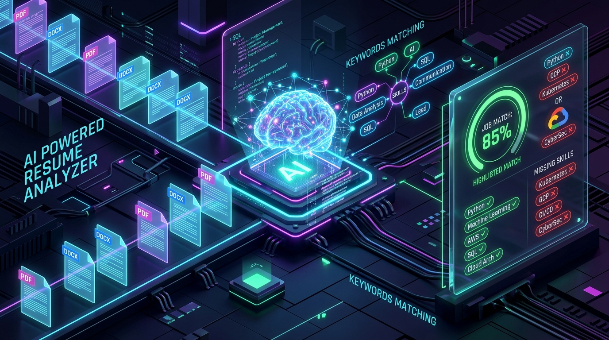
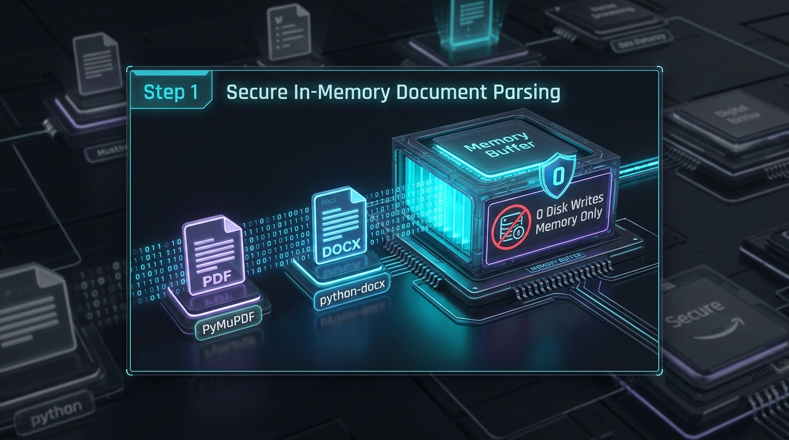
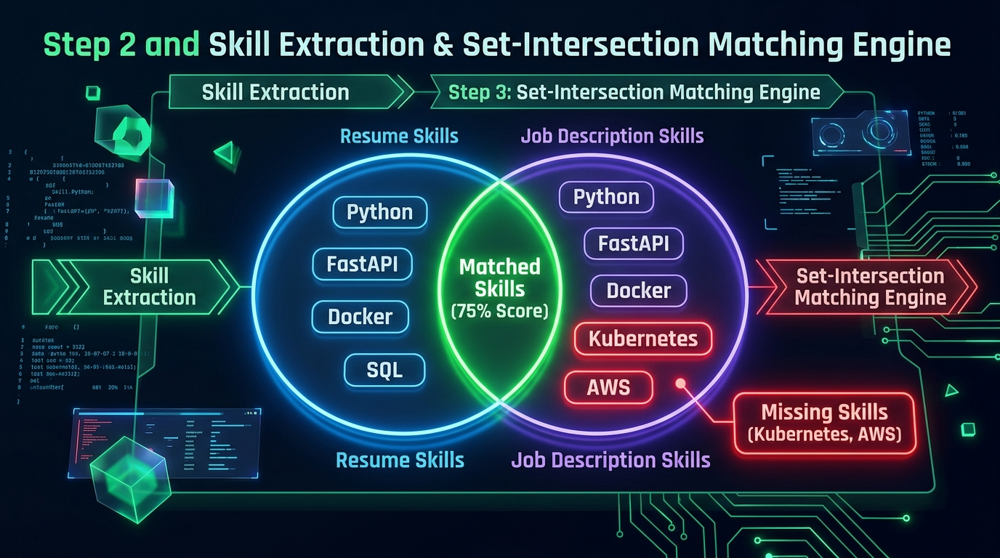
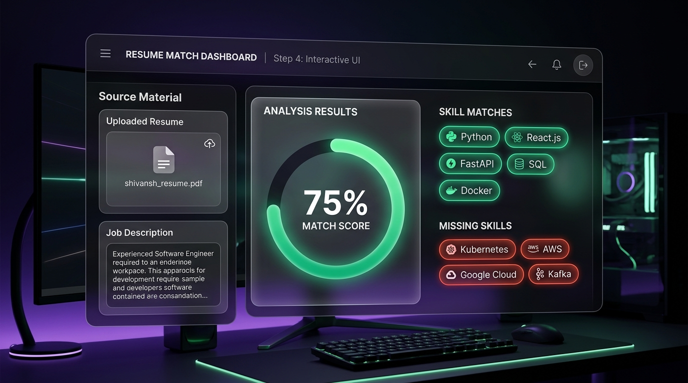

<div align="center">

# 🚀 AI-Powered Resume & Job Description Analyzer
### *Smart Resume Matching, Skill Gap Analysis & AI Insights Engine*

[](https://fastapi.tiangolo.com/)
[](https://reactjs.org/)
[](https://vitejs.dev/)
[](https://www.python.org/)
[](https://docs.pytest.org/)
[](https://github.com/Shivansh-mishraji/AI-Powered-Resume-Analyzer/actions/workflows/ci.yml)
[](#)

<br/>



<p align="center">
  <b>Upload your resume (PDF/DOCX) + Paste a Job Description → Instant Match Score, Extracted Tech Skills, and Skill Gap Analysis!</b>
</p>

</div>

---

## 🌟 What is this Project?

Job hunting is competitive. Most candidates don't know why their resumes get rejected by Applicant Tracking Systems (ATS). 

The **AI-Powered Resume Analyzer** bridges this gap:
1. 📄 **Instant In-Memory Parsing:** Reads PDF and DOCX resumes safely in memory without writing temporary files to disk.
2. 🔍 **50+ Tech Skills Extraction:** Automatically detects languages, frameworks, cloud tools, databases, and AI libraries from both documents.
3. 🎯 **Match Score & Skill Gap:** Compares your resume against the exact Job Description and calculates a clean match percentage.
4. 💡 **Actionable Insights:** Pinpoints the exact missing skills you need to add before applying.

---

## 🔬 How It Works: Step-by-Step Visual Walkthrough

Here is exactly how data moves through our system from raw document upload to final visual insights:

---

### 📥 Step 1: Secure In-Memory Document Parsing (`resume_parser.py`)

<div align="center">
  
</div>

* **How it works:** When a user uploads a `.pdf` or `.docx` file, FastAPI accepts the binary stream in RAM.
* **Security & Speed:** We use **PyMuPDF (`fitz`)** for PDFs and **`python-docx`** for Word files. Zero temporary files are written to the disk, ensuring total privacy and near-instant (<50ms) text extraction.
* **Validation:** Strict MIME-type checking rejects any invalid file formats (e.g. `.jpg`, `.png`, `.exe`) with an HTTP 400 Bad Request error.

---

### 🧠 Step 2 & 3: Skill Extraction & Set-Intersection Scoring Engine (`skill_extractor.py` & `score_calculator.py`)

<div align="center">
  
</div>

* **Text Normalization:** `text_cleaner.py` strips noisy characters, bullet points, and normalizes capitalization.
* **Keyword Matching:** `skill_extractor.py` uses word-boundary regex patterns to detect 50+ industry-standard tech skills (Python, React, Docker, AWS, FastAPI, etc.) across both the candidate's resume and the recruiter's Job Description.
* **Mathematical Set Comparison:**
  $$\text{Matched Skills} = \text{Resume Skills} \cap \text{Job Description Skills}$$
  $$\text{Missing Skills} = \text{Job Description Skills} \setminus \text{Resume Skills}$$
  $$\text{Match Score} = \left( \frac{|\text{Matched Skills}|}{|\text{Job Description Skills}|} \right) \times 100$$

---

### 📊 Step 4: Interactive React Dashboard & Real-Time Feedback (`App.jsx`)

<div align="center">
  
</div>

* **Live Result Rendering:** The React client receives the JSON payload from `POST /analyze` and renders:
  * 🟢 **Score Gauge:** Visual radial progress bar displaying the candidate's match percentage.
  * ✅ **Green Badges:** Clean pill tags for skills the candidate already possesses.
  * ❌ **Red Warning Badges:** Clear missing skill alerts to help the candidate optimize their resume.

---

## 👥 The Dream Team & Role Breakdown

Our project is divided among 4 specialized members following Agile/Scrum engineering workflows:

<div align="center">

| Member | Role | GitHub Profile |
|---|---|---|
| **Shivansh Mishra** | Backend Lead + AI Engineer + Scrum Master | [@Shivansh-mishraji](https://github.com/Shivansh-mishraji) |
| **Harshwardhan Sisodiya** | Frontend Developer (UI/UX) | [@harsh123-code](https://github.com/harsh123-code) |
| **Vishal Patel** | Testing & QA Automation Specialist | [@patelvishal-ji](https://github.com/patelvishal-ji) |
| **Sujeet Kannaujiya** | Research Lead & Technical Writer | [@sujeet-official](https://github.com/sujeet-official) |

</div>

---

### 🔍 Member Activity: Done, Doing & Upcoming

#### ⚡ **Shivansh Mishra** — *Backend & AI Lead*
* ✅ **Done:** Built the FastAPI architecture, in-memory PDF/DOCX binary parsers (`PyMuPDF` & `python-docx`), text cleaner service, skill extractor with 50+ keywords, and the unified `POST /analyze` endpoint.
* 🔄 **Doing Now:** Configuring CORS middleware for zero-friction browser integration and fine-tuning scoring accuracy.
* 🚀 **Will Do:** Integrate Google Gemini AI API to generate real-time, bulleted resume improvement advice and personalized bullet points.

---

#### 🎨 **Harshwardhan Sisodiya** — *Frontend Developer*
* ✅ **Done:** Built the React + Vite frontend layout, custom responsive CSS design, resume file drop card, Job Description input box, and connected the client to the `/analyze` backend API.
* 🔄 **Doing Now:** Adding dynamic loading spinners, progress bar gauges for match score, and mobile view optimizations.
* 🚀 **Will Do:** Create an interactive results dashboard with exportable PDF report download cards and section-wise feedback tabs.

---

#### 🧪 **Vishal Patel** — *Testing & QA Specialist*
* ✅ **Done:** Created the automated test suite (`test_text_cleaner.py`, `test_skill_extractor.py`, `test_score_calculator.py`) achieving **29/29 passing unit tests** in under 1.4 seconds.
* 🔄 **Doing Now:** Stress-testing edge cases (multi-page resumes, distorted fonts, empty text, special characters like `C++` & `C#`).
* 🚀 **Will Do:** Write end-to-end integration test suites and performance load tests before final production deployment.

---

#### 📚 **Sujeet Kannaujiya** — *Research & Documentation*
* ✅ **Done:** Researched industry tools, authored [`API_REFERENCE.md`](./docs/API_REFERENCE.md), structured [`ARCHITECTURE.md`](./docs/ARCHITECTURE.md), and created [`RESEARCH.md`](./docs/RESEARCH.md) comparing FastAPI vs Flask and PyMuPDF vs PDFMiner.
* 🔄 **Doing Now:** Preparing viva preparation cheat sheets, user journey workflows, and system requirement specifications (SRS).
* 🚀 **Will Do:** Write the comprehensive Final Project Report, User Manual, and slide presentation for final evaluation.

---

## 🗺️ 6-Week Project Roadmap: Progress & What's Left

```
[████████████████████████████████░░░░░░░░░░░░] 60% Completed
```

### ✅ What We Have Done So Far (Weeks 1 – 3)
- [x] **Week 1 (Foundation):** FastAPI backend initialized, `/health` endpoint, strict PDF/DOCX MIME-type validation, and initial React Vite homepage.
- [x] **Week 2 (Text Cleaning & Skill Extraction):** Built `text_cleaner.py` (regex normalization) and `skill_extractor.py` (50+ tech skills dictionary with regex boundaries).
- [x] **Week 3 (Scoring & Full-Stack Integration):** Built `score_calculator.py` with set-intersection mathematics, upgraded `POST /analyze`, and connected React frontend to display live score, green matched tags, and red missing tags.
- [x] **Documentation & QA:** 29 automated test cases passing + complete architecture, API, and research documents.

---

### 🔄 What We Are Doing Now (Week 4)
- [ ] **CORS & Performance Hardening:** Finalizing cross-origin resource sharing between `:5173` and `:8000`.
- [ ] **Score Progress Gauge:** Visual radial/linear animation for the match percentage.
- [ ] **Resume Extracted Skills View:** Displaying all candidate skills alongside job requirements.

---

### 🚀 What is Left to Do (Weeks 5 – 6)
- [ ] **Week 5 (AI Integration):** Connect Google Gemini API to read missing skills and write customized, high-impact resume bullet points.
- [ ] **Week 6 (Export & Deployment):** One-click "Download PDF Analysis Report", cloud deployment (Vercel + Render), and final project submission.

---

## ⚡ Quick Start Guide (Run Locally in 2 Minutes)

### 1️⃣ Clone the Repository
```bash
git clone https://github.com/Shivansh-mishraji/AI-Powered-Resume-Analyzer.git
cd "AI-Powered-Resume-Analyzer"
```

### 2️⃣ Start the Backend
```bash
cd backend
python -m venv .venv
.venv\Scripts\activate      # On macOS/Linux: source .venv/bin/activate
pip install -r requirements.txt
python -m uvicorn app.main:app --reload
```
👉 *Backend API Swagger Docs:* **`http://127.0.0.1:8000/docs`**

### 3️⃣ Start the Frontend
```bash
# In a new terminal window:
cd frontend
npm install
npm run dev
```
👉 *Frontend App Live:* **`http://localhost:5173/`**

### 4️⃣ Run the Automated Test Suite (29 Tests)
```bash
cd backend
python -m pytest tests/ -v
```

---

<div align="center">
  <sub>Built with ❤️ by Shivansh, Harshwardhan, Vishal & Sujeet | Academic Minor Project 2026</sub>
</div>
