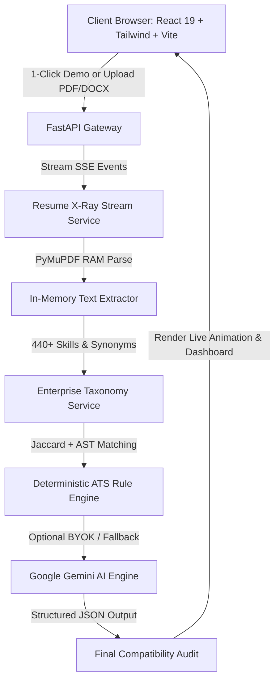

# Project Synopsis: Next-Gen AI-Powered Resume & ATS Compatibility Analyzer

**Project Title:** AI-Powered Resume & Job Description Compatibility Analyzer  
**Domain:** Artificial Intelligence, Natural Language Processing, Full-Stack Web Development, HR-Tech  
**Project Lead:** Shivansh Mishra & Engineering Team  
**Repository:** `Shivansh-mishraji/AI-Powered-Resume-Analyzer`  

---

## 1. Executive Summary & Problem Statement

Over **75% of qualified job applicants** are filtered out by automated Applicant Tracking Systems (ATS) before a human recruiter ever sees their resume. Job seekers typically face three frustrating roadblocks:
1. **The ATS "Black Box":** Applicants receive generic automated rejection emails without knowing why their resume failed or which keywords were missing.
2. **Expensive or Invasive Tools:** Existing commercial analyzers charge monthly subscriptions ($20–$50/month) and permanently store sensitive personal data (phone numbers, addresses, employment history) in third-party databases.
3. **Complex, Confusing Dashboards:** Existing platforms present cluttered statistics with heavy jargon that average job seekers cannot understand or act upon.

---

## 2. Proposed Solution & Core Innovation

We built a **100% Free, Zero-Persistence, Dual-Engine Resume & Job Description Analyzer** designed for instant clarity, total data privacy, and actionable feedback.

### Key Architectural Pillars:
- **Dual-Engine Processing:**
  - **Deterministic Rule Engine (Engine A):** Analyzes documents using tokenized Jaccard similarity and an enterprise **440+ skill knowledge graph** (synonym resolution, e.g., mapping `NodeJS` → `Node.js`). Runs 100% locally with zero external API calls.
  - **Generative AI Engine (Engine B):** Connects to Google Gemini via a **Bring-Your-Own-Key (BYOK)** model. Operates completely within Google AI Studio's free tier (1,500 requests/day, $0.00 cost risk).
- **RAM-Only Privacy (Zero-Persistence):** Documents are parsed in-memory using PyMuPDF and immediately garbage-collected. No database storage, no user tracking, zero data leakage.
- **Live "Resume X-Ray" Visualizer:** Rather than a boring spinning wheel, users watch a real-time Server-Sent Events (SSE) animation showing document scan lines, skill extraction chips popping up, knowledge graph alias matching, and live score calculation.
- **1-Click Instant Demo:** Anyone (including evaluators, judges, or users on mobile) can click one button to load a verified sample resume and job description to test the complete pipeline in under 1 second without uploading a file.
- **30-Second Verdict:** The results dashboard leads with an emoji-powered, plain-English summary that tells any user within 10 seconds: *What went well*, *What's missing*, and *The exact 2-step fix*.

---

## 3. High-Level System Architecture

---

## 4. Technical Specifications & Stack

| Layer | Technology Stack | Key Responsibilities |
| :--- | :--- | :--- |
| **Frontend** | React 19, Vite, Tailwind CSS, Lucide Icons | GPU-accelerated glassmorphism UI, 60/120fps score gauge physics, SSE streaming consumer |
| **Backend** | Python 3.13, FastAPI, Uvicorn, Asyncio | Non-blocking async endpoints, Server-Sent Events (SSE) pipeline, strict 5MB payload limits |
| **Parsing Engine** | PyMuPDF (fitz), python-docx | In-memory text extraction, multi-column reading order preservation, zero disk writes |
| **Taxonomy Graph**| Custom Python Graph Dictionary (440+ skills) | Multi-domain alias normalization (Frontend, Backend, DevOps, Data/AI, Cloud) |
| **AI Integration** | Google Gemini API (via google-genai SDK) | Semantic gap synthesis, context-aware suggestions, graceful rule-engine fallback |
| **Security & Privacy**| RAM-only execution, SessionStorage BYOK | Client-side API key encryption, sanitized inputs, zero database persistence |

---

## 5. Key Highlights for Project Evaluation & Judges

1. **Working Demo Readiness:** 1-Click instant sample loads in 200ms; full real-time X-Ray animation runs on both desktop and mobile.
2. **Deterministic Reliability:** Passes 92 automated backend unit & integration tests (`pytest 92 passed in 11.75s`).
3. **100% Free Forever:** Zero server database maintenance costs, zero paid third-party API dependencies.
4. **Friendly Usability:** Every score is explained with intuitive hover tooltips, visual gauges, and crisp bullet points.
