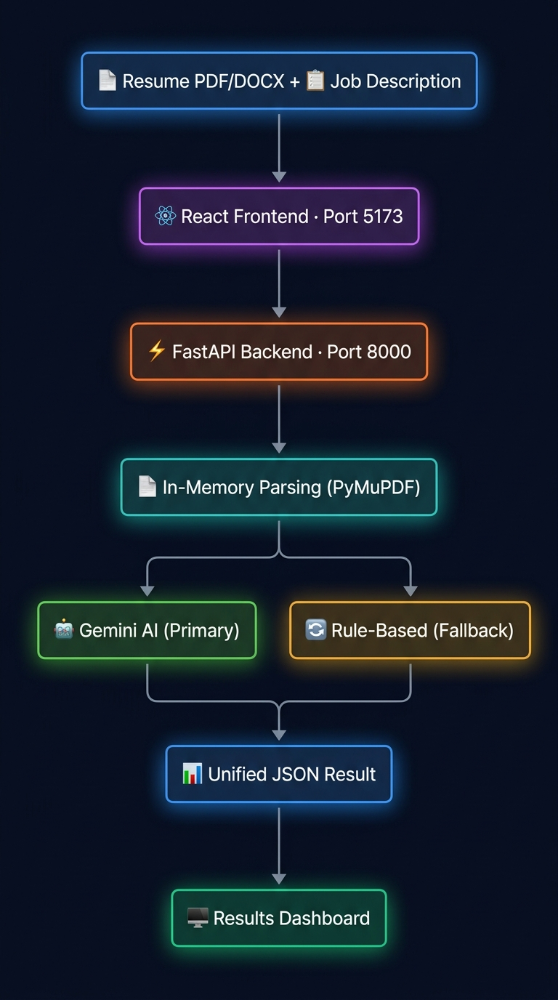
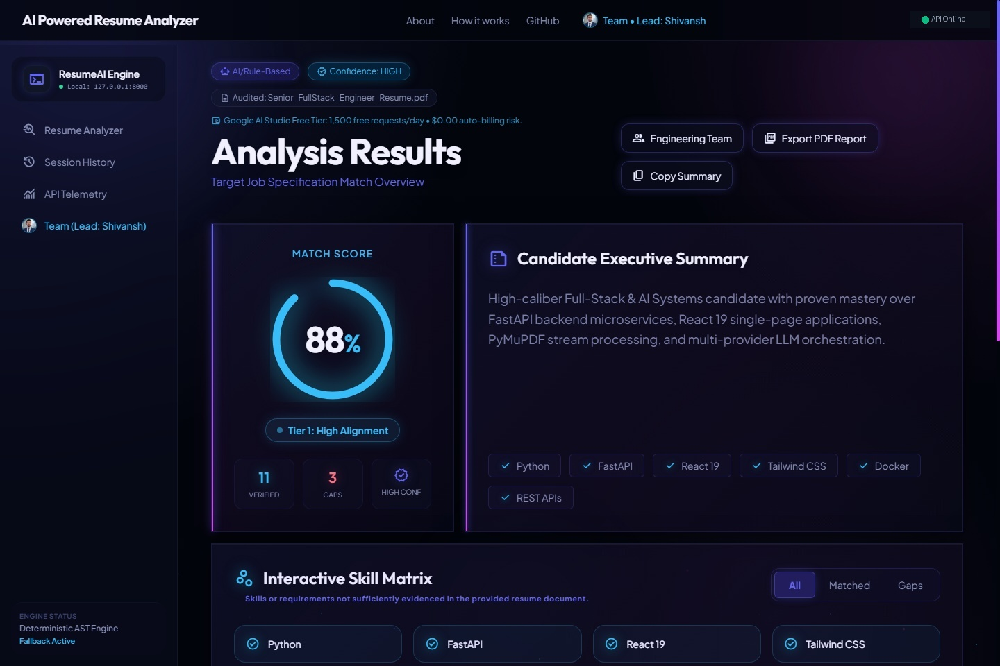

# System Architecture — AI-Powered Resume Analyzer

> **Conceived, Architected & Directed by:** [Shivansh Mishra](https://github.com/Shivansh-mishraji) (Team Leader & Principal Architect)  
> **Documented by:** Sujeet Kannaujiya (Research & Documentation Lead)  
> **Evaluation:** BBD University • Academic Capstone 2026

- **Live Application:** [https://ai-powered-resume-analyzer-pi.vercel.app](https://ai-powered-resume-analyzer-pi.vercel.app)
- **Live Backend API:** [https://resume-analyzer-api.onrender.com](https://resume-analyzer-api.onrender.com)

---

## 🏛️ High-Level System Architecture



The AI-Powered Resume Analyzer implements a **Hybrid Multi-Model & Deterministic Architecture** using a Bring-Your-Own-Key (BYOK) model. 

```
┌────────────────────────────────────────────────────────────────────────┐
│                                 USER                                   │
│             (Browser at ai-powered-resume-analyzer-pi.vercel.app)       │
└───────────────────────────────────┬────────────────────────────────────┘
                                    │ HTTP POST /analyze
                                    │ Headers: 'X-Gemini-API-Key' (Optional multi-provider key)
                                    │ Body: multipart/form-data (Resume, JD)
                                    ▼
┌────────────────────────────────────────────────────────────────────────┐
│                        FRONTEND (React 19 + Vite)                      │
│                                                                        │
│   App.jsx                                                              │
│   ├── Multi-Provider BYOK (Gemini AQ./AIza, OpenAI, Claude)            │
│   ├── Drag-and-Drop File Upload (PDF / DOCX in-memory)                 │
│   ├── Target Job Description Textarea & Quick Templates                │
│   ├── Silent Backend Warmup Trigger (warmUpBackend on mount)           │
│   ├── GPU-Accelerated Nebula Aurora Background & Reduced-Motion Guard  │
│   └── 60/120 FPS rAF Score Dashboard (Score, Skills, Strengths, Advice)│
└───────────────────────────────────┬────────────────────────────────────┘
                                    │ HTTP Request (CORS scoped to origin)
                                    ▼
┌────────────────────────────────────────────────────────────────────────┐
│                        BACKEND (FastAPI + Uvicorn)                     │
│                                                                        │
│   HTTP Gateway (`main.py`)                                             │
│   ├── GET  /health           ──> System health check                   │
│   └── POST /analyze          ──> Passes request to Analysis Service    │
│                                                                        │
│   Configuration Layer (`config.py`)                                    │
│   ├── MAX_FILE_SIZE_BYTES    ──> 5 MB                                  │
│   ├── MAX_RESUME_CHARS       ──> 15,000 characters                     │
│   ├── MAX_JD_CHARS           ──> 5,000 characters                      │
│   └── ALLOWED_CORS_ORIGINS   ──> Explicit frontend origins             │
│                                                                        │
│   Parsing & In-Memory Extraction Layer (`resume_parser.py`)            │
│   ├── PyMuPDF (`fitz` / `pymupdf`) with `sort=True` block sorting      │
│   ├── python-docx for Word document streams                            │
│   └── Scanned PDF detection (rejection if extractable text < 50 chars) │
│                                                                        │
│   Analysis Router (`services/analysis_service.py`)                     │
│   ├── Decides engine execution based on API key availability           │
│   ├── Calls AI Service (with 1-retry policy for transient errors)      │
│   └── Triggers Rule-Based Service on missing key or service failure    │
│                                                                        │
│   Primary Engine (`services/ai_service.py`)                            │
│   ├── Google Gemini LLM (via official `google-genai` SDK)              │
│   ├── Strict Rubric-Grounded System Prompting                          │
│   └── Structured JSON Output Validation via Pydantic                   │
│                                                                        │
│   Fallback Engine (`services/rule_based_service.py`)                   │
│   ├── Text Cleaner (`text_cleaner.py`)                                 │
│   ├── 50+ Skill Keyword Extractor (`skill_extractor.py`)               │
│   └── Set-Intersection Scorer (`score_calculator.py`)                 │
│                                                                        │
│   Unified Schema Contract (`schemas/analysis_schema.py`)               │
│   └── AnalysisResult (Single response format for both engines)         │
└────────────────────────────────────────────────────────────────────────┘
```

---

## 🔄 End-to-End Data Flow (`POST /analyze`)

```
User uploads Resume + pastes Job Description + optional Gemini Key
                             │
                             ▼
     [1. Request Gateway & Validation]
     ├── Validate Content-Type (application/pdf or docx)
     ├── Enforce file size limit (≤ 5MB)
     └── Read binary stream directly into RAM
                             │
                             ▼
     [2. Parsing & Text Normalization]
     ├── Extract text stream in memory (sort=True)
     ├── Scanned image check (len(text) ≥ 50 chars)
     ├── Normalize whitespace & format bounds
     └── Check text length limits (warn if truncated)
                             │
                             ▼
     [3. Analysis Router Decision]
                    │
            API Key Provided?
             /             \
           YES              NO
            │                │
            ▼                ▼
     [4. Gemini AI Service]  [4b. Rule-Based Engine]
     ├── Rubric-based prompt ├── Clean text (regex)
     ├── Structured JSON     ├── Extract 50+ keywords
     ├── 1-retry on failure  └── Calculate set score
     │                       │
     ├── Success ────┐       │
     └── Failure ─┐  │       │
                  │  │       │
                  ▼  ▼       ▼
     [5. Unified Result Builder]
     ├── Maps output to `AnalysisResult` Pydantic model
     ├── Sets `is_ai_powered`: true / false
     ├── Sets `analysis_confidence`: "high" | "medium" | "low" | "not_applicable"
     └── Populates `warnings` array for transparency
                             │
                             ▼
     [6. JSON Response ──> React Dashboard]
```

---

## 🔐 Security & Privacy Architecture (BYOK Model)

1. **In-Memory Lifespan:** The user's Gemini API key is accepted via the `X-Gemini-API-Key` HTTP header. It resides only in temporary process memory for the duration of the request.
2. **Zero Storage / Zero Logging:** The key is never written to disk, never saved to a database, and never printed in server or access logs.
3. **Frontend Memory State:** In React, the key is held in component runtime state (`useState`) with an optional clear button. It is not saved in `localStorage`.
4. **CORS Boundary:** The API only allows requests from verified frontend origins, preventing unauthorized cross-site invocations.

---

## 📦 Unified Data Contract

Both engines return the identical Pydantic schema:

```python
class AnalysisResult(BaseModel):
    filename: str
    score: int                              # 0 to 100
    is_ai_powered: bool
    analysis_confidence: Literal["high", "medium", "low", "not_applicable"]
    candidate_summary: str
    matched_skills: List[str]
    missing_skills: List[str]
    strengths: List[str]                    # Empty list in fallback mode
    weaknesses: List[str]                   # Empty list in fallback mode
    suggestions: List[str]                  # Empty list in fallback mode
    warnings: List[str]
```

---

## ⚙️ Component Responsibilities

| Component | File Path | Core Responsibility |
|---|---|---|
| **Central Config** | `backend/app/config.py` | Constants, thresholds, file bounds, CORS origins. |
| **Pydantic Schema** | `backend/app/schemas/analysis_schema.py` | Standardized response contract for all engines. |
| **Resume Parser** | `backend/app/services/resume_parser.py` | In-memory text extraction, reading order sorting, image scan detection. |
| **Rule-Based Engine** | `backend/app/services/rule_based_service.py` | Deterministic keyword extraction, set-math scoring, fallback schema mapping. |
| **Gemini AI Service** | `backend/app/services/ai_service.py` | Gemini LLM integration, rubric-grounded prompt, structured JSON validation, 1-retry logic. |
| **Analysis Router** | `backend/app/services/analysis_service.py` | Orchestration, engine routing, graceful error recovery, fallback tagging. |
| **HTTP Gateway** | `backend/app/main.py` | FastAPI routes, CORS middleware, multipart request receiving. |
| **Frontend UI** | `frontend/src/App.jsx` | BYOK key input, debounce handling, unified dashboard visualizer. |

---

## 🖥️ Production Interface & Visual Physics



*Interactive Glassmorphic Dashboard: 60/120 FPS Radial Gauge, Deep Semantic Matching & Strengths Breakdown.*

---

## 👥 Architecture Team & Technical Ownership

| Member | Architectural Role | Core Technical Ownership |
|---|---|---|
| 👑 **Shivansh Mishra** | **Team Leader & Principal Architect** | End-to-end platform design, FastAPI Gateway, Multi-Provider AI Rubric Engine, in-memory PyMuPDF streaming (`sort=True`), deterministic fallback orchestration, and production deployments on Render & Vercel. |
| **Harshvardhan Sisodiya** | Frontend Architect • UI/UX Lead | React 19 SPA modular architecture, Nebula Aurora glassmorphism, 60fps rAF count-up physics, and BYOK security hub. |
| **Vishal Patel** | QA Lead • Security & Automated Testing | 39/39 passing pytest test suite, multi-provider AI mock testing (401, 429), and text sanitization validators. |
| **Sujeet Kannaujiya** | Research Lead • Technical Documentation | ATS parsing literature review, framework benchmarking, and ethical rubric documentation. |

